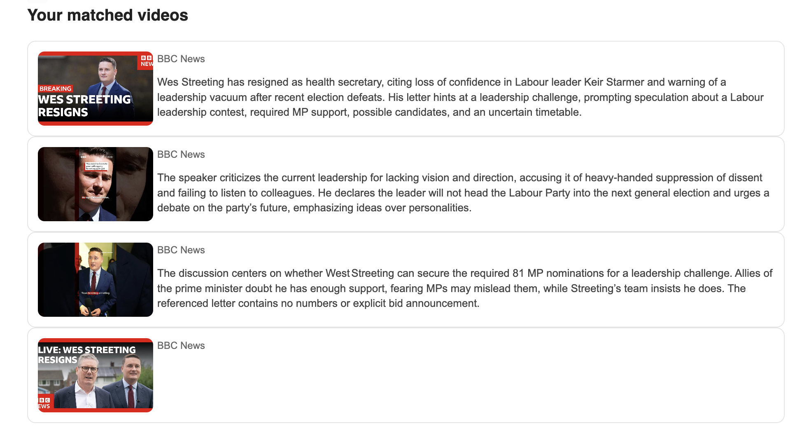

<h1 align="center"> YouTube Alert System </h1>


The **YouTube Alert System** is a Python-based application that extracts video data from YouTube channels, extract transcript and summarize it, and stores the data in a Supabase database. It also includes functionality to match keywords in video content and send alerts via email.

---

## Features

- **YouTube Channel Scraper**: Extracts video metadata and transcripts from YouTube channels using RSS feeds, `yt-dlp`.
- **Content Analysis**: Summarizes video transcripts using the Groq API.
- **Database Integration**: Stores video data in a Supabase database.
- **Keyword Matching**: Matches keywords in video content and triggers alerts.
- **Email Notifications**: Sends email alerts for matched videos using Supabase Edge Functions and Resend.

---

## Project Structure

```
.env.example
main.py
app/
    analyzer.py
    youtubeChannelController.py
    youtubeVideoController.py
database/
    cron.sql
    edge_function_alert.js
    init_db.sql
    keywords_match.sql
```

- **`main.py`**: Entry point for the application.
- **`app/`**: Contains the core logic for scraping and analyzing YouTube videos.
- **`database/`**: SQL scripts and Supabase client for database operations.
- **`.env.example`**: Stores environment variables (e.g., Supabase, Groq, Resend credentials and the proxy url).

---

## Prerequisites

- Python 3.10+
- Supabase account
- Groq account
- Resend account (for email notifications)

---

## Installation

1. Clone the repository:

   ```bash
   git clone https://github.com/sarrarmohcin/YouTube-Alert-System.git
   cd youtube-alert
   ```

2. Install Python dependencies:

   ```bash
   pip install -r requirements.txt
   ```

3. Set up environment variables:

   - Copy `.env.example` to `.env`:
     ```bash
     cp .env.example .env
     ```
   - Fill in the required values in `.env`.

4. Initialize the database:

   - Run the SQL scripts in `database/` to set up the required tables and functions.

5. Deploy the Edge Function:

   - Deploy `edge_function_alert.js` to your Supabase Edge Functions.

6. Add searched keywords to `alert_keywords` table

7. Add YouTube channelto `yt_sources` table, Note: the url must be in format `https://www.youtube.com/feeds/videos.xml?channel_id=THE_CHANNEL_ID`

---

## Usage

1. Run the application:

   ```bash
   python main.py
   ```

2. The application will:

   - Get channels from `yt_sources` table
   - Scrape videos from the specified YouTube channel.
   - Analyze video content and generate summaries.
   - Store the data in the Supabase database.

3. Alerts:
   - The `keywords_match.sql` function matches keywords in video content.
   - The `cron.sql` script schedules periodic scans and triggers the Edge Function to send email alerts.

---

## Environment Variables

| Variable            | Description                                                                 |
| ------------------- | --------------------------------------------------------------------------- |
| `SUPABASE_URL`      | Your Supabase project URL.                                                  |
| `SUPABASE_KEY`      | Your Supabase secret key.                                                   |
| `GROQ_KEY`          | Groq API Key for video Analyzer (extract summary).                          |
| `PROXY_URL`         | Proxy used to download transcript without get the "Too Many Requests" error |
| `RESEND_TO_EMAIL`   | Recipient email address. (stored in Supabase Secrets)                       |
| `RESEND_API_KEY`    | API key for Resend email service. (stored in Supabase Secrets)              |
| `RESEND_FROM_EMAIL` | Sender email address. (stored in Supabase Secrets)                          |
| `RESEND_TO_EMAIL`   | Recipient email address. (stored in Supabase Secrets)                       |


## DEMO

After configration and execution of the project, an email will be sent to the `RESEND_TO_EMAIL` contains matched videos



---

## Acknowledgments

- [Supabase](https://supabase.com)
- [Resend](https://resend.com)
- [yt-dlp](https://github.com/yt-dlp/yt-dlp)
- [Groq](https://groq.com)
